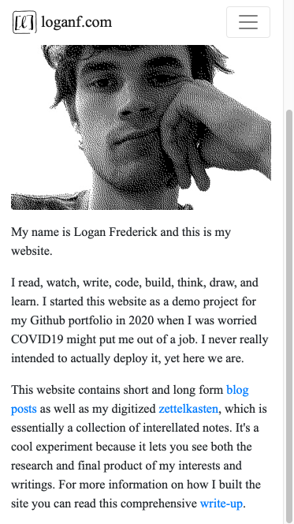
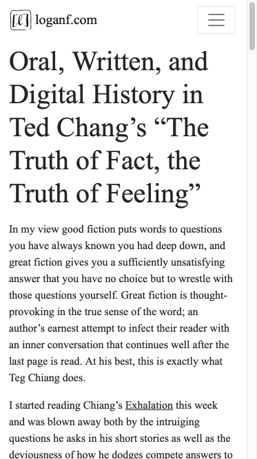

personal website project
========================

A website drawing from content written in Vim, using the Vimwiki plugin (with
markdown syntax rather than wiki syntax) compiled using a custom python script
calling Pandoc, but using custom Pandoc templating to compile into Jinja2
templates rather than HTML, and displayed using a Flask webserver.

It's a very niche solution to a very niche problem.

## Why so convoluted?

1. I already use Vim and the Vimwiki / Vim-Zettel plugins for organizing all my
   notes, passwords, bookmarks, thoughts, etc. so this part makes my life
   easier. I already have a library of content in this system.

2. Even though Pandoc isn't the most lightweight way to compile markdown to
   HTML, I find the Pandoc markdown syntax to be the most robust and
   convenient. I especially like that I can cleanly define custom metadata
   using a YAML section at the top of each document. At compile-time I can tell
   Pandoc to generate separate JSONs from the YAML metadata in each file as a
   simple way of aggregating metadata for an eventual no-SQL database.

3. Compiling to Jinja2 templates as an intermediary rather than directly to
   HTML is probably redundant, but I'm much more familiar with how template
   inheritance works in Jinja2.

The ultimate goal here is to use Git hooks to make everything seamless.

## Screenshots

